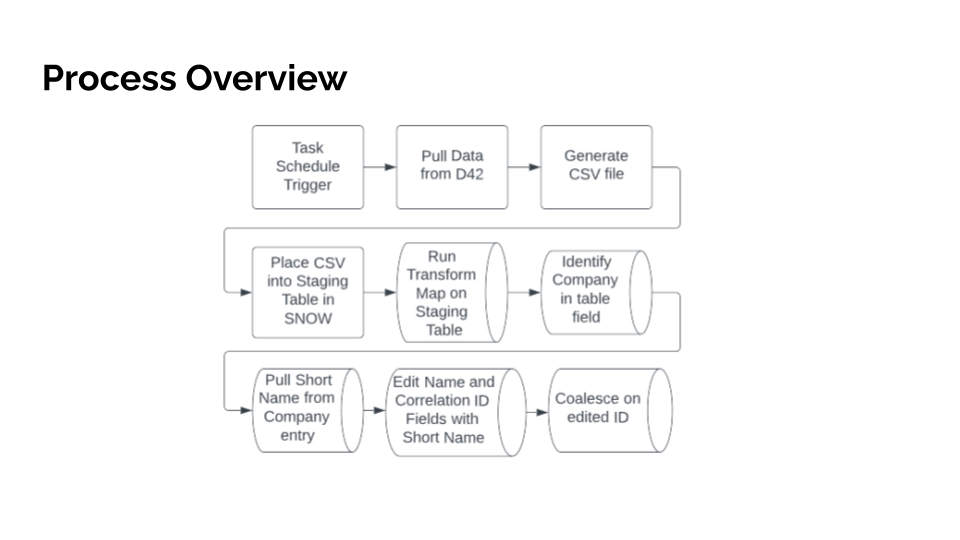

<!-- Improved compatibility of back to top link: See: https://github.com/othneildrew/Best-README-Template/pull/73 -->
<a name="readme-top"></a>
<!--
*** Thanks for checking out the Best-README-Template. If you have a suggestion
*** that would make this better, please fork the repo and create a pull request
*** or simply open an issue with the tag "enhancement".
*** Don't forget to give the project a star!
*** Thanks again! Now go create something AMAZING! :D
-->


<!-- PROJECT SHIELDS -->
<!--
*** I'm using markdown "reference style" links for readability.
*** Reference links are enclosed in brackets [ ] instead of parentheses ( ).
*** See the bottom of this document for the declaration of the reference variables
*** for contributors-url, forks-url, etc. This is an optional, concise syntax you may use.
*** https://www.markdownguide.org/basic-syntax/#reference-style-links
-->
<!-- Unsure how to link
[![Contributors][contributors-shield]][contributors-url]
[![Forks][forks-shield]][forks-url]
[![Stargazers][stars-shield]][stars-url]
[![Issues][issues-shield]][issues-url]
[![MIT License][license-shield]][license-url]
[![LinkedIn][linkedin-shield]][linkedin-url]


<!-- PROJECT LOGO -->
<br />
<div align="center">
  <a href="https://github.com/CC-Digital-Innovation/D42">
    
  </a>

<h3 align="center">Device42 SNOW Integration</h3>

  <p align="center">
    Updates SNOW automatically by pulling from D42
    <br />
    <a href="https://github.com/CC-Digital-Innovation/D42"><strong>Explore the docs »</strong></a>
    <br />
    <br />
    <a href="https://github.com/CC-Digital-Innovation/D42/blob/main/Demo%20Presentation.md">View Demo Presentation</a>
    ·
    <a href="https://github.com/CC-Digital-Innovation/D42/issues">Report Bug</a>
  </p>
</div>


<!-- TABLE OF CONTENTS -->
<details>
  <summary>Table of Contents</summary>
  <ol>
    <li>
      <a href="#usage">Usage</a>
      <ul>
        <li><a href="#how">How</a></li>
      </ul>
      <ul>
        <li><a href="#built-with">Built With</a></li>
      </ul>
    </li>
    <li>
      <a href="#getting-started">Getting Started</a>
      <ul>
        <li><a href="#prerequisites">Prerequisites</a></li>
        <li><a href="#installation">Installation</a></li>
      </ul>
    </li>
    <li><a href="#roadmap">Roadmap</a></li>
    <li><a href="#history">History</a></li>
    <li><a href="#contact">Contact</a></li>
    <li><a href="#acknowledgments">Acknowledgments</a>
    <li><a href="#license">License</a></li>
    </li>
  </ol>
</details>

---

<!-- ABOUT THE PROJECT -->
## Usage
Automate pulling Device42 data into a CSV file that is then stagged in ServiceNow to process the file information using a task scheduler for execution given a date and time.

## How


<a href="https://github.com/CC-Digital-Innovation/D42/blob/main/Demo%20Presentation.md"><strong>Further information »</strong></a>

---

### Built With

[![Python][Python]][Python-url]

<p align="right">(<a href="#readme-top">back to top</a>)</p>


---
<!-- GETTING STARTED -->
## Getting Started

### Prerequisites
1. [Python version 3.7.14+](https://www.python.org/downloads/)
3. Customer virtual environment
3. Clone repository
4. Install `requirements.txt`


---

## Installation
### Clone the repository
   ```sh
   git clone https://github.com/CC-Digital-Innovation/D42.git
  ```

### Install `requirements.txt`
```sh
pip install -r requirements.txt
```
`NOTE:` The following will be installed
* [loguru version 0.6.0](https://pypi.org/project/loguru/)
* [requests version 2.28.1](https://pypi.org/project/requests/2.8.1/)
* [urllib3 version 1.26.12](https://urllib3.readthedocs.io/en/stable/)

---

### Edit `config.ini`
Replace placeholders:
```js
[Device42]
user : D42_USERNAME_PLACEHOLDER
pass : D42_PASSWORD_PLACEHOLDER
url : D42_URL_PLACEHOLDER
customer : D42_CUSTOMER_PLACEHOLDER
location : D42_LOCATION_PLACEHOLDER
content-type : application/json

[ServiceNow]
user : SNOW_USERNAME_PLACEHOLDER
pass : SNOW_PASSWORD_PLACEHOLDER
url : SNOW_URL_PLACEHOLDER
```

<p align="right">(<a href="#readme-top">back to top</a>)</p>

---

<!-- ROADMAP -->
## Roadmap
<p> 1. Store CSV file to database
</p>
<p>
2. Email alert when task is completed
</p>

<p align="right">(<a href="#readme-top">back to top</a>)</p>

---
<!-- HISTORY -->
## History
<p>version 0.1 (initial release) - 2022/08/08</p>
<p>version 0.2 (readme.md) - 2022/09/01</p>
<p>version 0.3 (readme.md updates and repo cleanup) - 2022/09/07</p>

---
<!-- CONTACT -->
## Contact

Alex Barraza - [@sabarraz](https://github.com/sabarraz) - alex.barraza@computacenter.com

Project Link: [https://github.com/CC-Digital-Innovation/D42](https://github.com/CC-Digital-Innovation/D42)


<!-- ACKNOWLEDGMENTS -->
## Acknowledgments
[Stefan Axelson](stefan.axelson@computacenter.com)

[Richard Travellin](richard.travellin@computacenter.com)

<p align="right">(<a href="#readme-top">back to top</a>)</p>

---
<!-- LICENSE -->
## License

MIT License

Copyright (c) [2022] [Computacenter]

Permission is hereby granted, free of charge, to any person obtaining a copy of this software and associated documentation files (the "Software"), to deal in the Software without restriction, including without limitation the rights to use, copy, modify, merge, publish, distribute, sublicense, and/or sell copies of the Software, and to permit persons to whom the Software is furnished to do so, subject to the following conditions:

The above copyright notice and this permission notice shall be included in all copies or substantial portions of the Software.

THE SOFTWARE IS PROVIDED "AS IS", WITHOUT WARRANTY OF ANY KIND, EXPRESS OR IMPLIED, INCLUDING BUT NOT LIMITED TO THE WARRANTIES OF MERCHANTABILITY, FITNESS FOR A PARTICULAR PURPOSE AND NONINFRINGEMENT. IN NO EVENT SHALL THE AUTHORS OR COPYRIGHT HOLDERS BE LIABLE FOR ANY CLAIM, DAMAGES OR OTHER LIABILITY, WHETHER IN AN ACTION OF CONTRACT, TORT OR OTHERWISE, ARISING FROM, OUT OF OR IN CONNECTION WITH THE SOFTWARE OR THE USE OR OTHER DEALINGS IN THE SOFTWARE.

<p align="right">(<a href="#readme-top">back to top</a>)</p>


<!-- MARKDOWN LINKS & IMAGES -->
<!-- https://www.markdownguide.org/basic-syntax/#reference-style-links -->
[contributors-shield]: https://img.shields.io/github/contributors/CC-Digital-Innovation/D42.svg?style=for-the-badge
[contributors-url]: https://github.com/CC-Digital-Innovation/D42/graphs/contributors
[forks-shield]: https://img.shields.io/github/forks/CC-Digital-Innovation/D42.svg?style=for-the-badge
[forks-url]: https://github.com/CC-Digital-Innovation/D42/network/members
[stars-shield]: https://img.shields.io/github/stars/CC-Digital-Innovation/D42.svg?style=for-the-badge
[stars-url]: https://github.com/CC-Digital-Innovation/D42/stargazers
[issues-shield]: https://img.shields.io/github/issues/CC-Digital-Innovation/D42.svg?style=for-the-badge
[issues-url]: https://github.com/CC-Digital-Innovation/D42/issues
[license-shield]: https://img.shields.io/github/license/CC-Digital-Innovation/D42.svg?style=for-the-badge
[license-url]: https://github.com/CC-Digital-Innovation/D42/blob/master/LICENSE.txt
[linkedin-shield]: https://img.shields.io/badge/-LinkedIn-black.svg?style=for-the-badge&logo=linkedin&colorB=555
[linkedin-url]: https://www.linkedin.com/in/alex-barraza-474289192
[product-screenshot]: images/screenshot.png
[Python]: https://img.shields.io/badge/python-000000?style=for-the-badge&logo=python&logoColor=green
[Python-url]: https://www.python.org/
[React.js]: https://img.shields.io/badge/React-20232A?style=for-the-badge&logo=react&logoColor=61DAFB
