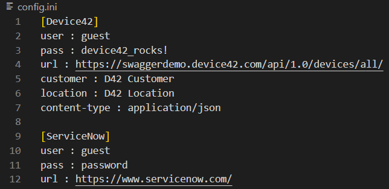

<!-- Improved compatibility of back to top link: See: https://github.com/othneildrew/Best-README-Template/pull/73 -->
<a name="readme-top"></a>
<!--
*** Thanks for checking out the Best-README-Template. If you have a suggestion
*** that would make this better, please fork the repo and create a pull request
*** or simply open an issue with the tag "enhancement".
*** Don't forget to give the project a star!
*** Thanks again! Now go create something AMAZING! :D
-->


<!-- PROJECT SHIELDS -->
<!--
*** I'm using markdown "reference style" links for readability.
*** Reference links are enclosed in brackets [ ] instead of parentheses ( ).
*** See the bottom of this document for the declaration of the reference variables
*** for contributors-url, forks-url, etc. This is an optional, concise syntax you may use.
*** https://www.markdownguide.org/basic-syntax/#reference-style-links
-->
<!-- PROJECT LOGO -->
<br />
<div align="center">
  <a href="https://github.com/CC-Digital-Innovation/D42">
    
  </a>

<h3 align="center">Device42 SNOW Integration</h3>

  <p align="center">
    Updates SNOW automatically by pulling from D42
    <br />
    <a href="https://github.com/CC-Digital-Innovation/D42"><strong>Explore the docs »</strong></a>
    <br />
    <br />
    <a href="https://github.com/CC-Digital-Innovation/D42/blob/main/Demo%20Presentation.md">View Demo Presentation</a>
    ·
    <a href="https://github.com/CC-Digital-Innovation/D42/issues">Report Bug</a>
    ·
    <a href="https://github.com/CC-Digital-Innovation/D42/issues">Request Feature (Request Log)</a>
  </p>
</div>


<!-- TABLE OF CONTENTS -->
<details>
  <summary>Table of Contents</summary>
  <ol>
    <li>
      <a href="#about-the-project">About The Project</a>
      <ul>
        <li><a href="#built-with">Built With</a></li>
      </ul>
    </li>
    <li>
      <a href="#getting-started">Getting Started</a>
      <ul>
        <li><a href="#prerequisites">Prerequisites</a></li>
        <li><a href="#installation">Installation</a></li>
        <li><a href="#scheduler">Task Scheduler Automation Setup</a></li>
      </ul>
    </li>
    <li><a href="#roadmap">Roadmap</a></li>
    <li><a href="#license">License</a></li>
    <li><a href="#contact">Contact</a></li>
    <li><a href="#acknowledgments">Acknowledgments</a></li>
  </ol>
</details>


<!-- ABOUT THE PROJECT -->
## About The Project
Automate pulling Device42 data into a CSV file that is then stagged in ServiceNow to process the information using a task scheduler for execution given a date and time.
<a href="https://github.com/CC-Digital-Innovation/D42/blob/main/Demo%20Presentation.md"><strong>Further information »</strong></a>

<p align="right">(<a href="#readme-top">back to top</a>)</p>


### Built With

[![Python][Python]][Python-url]

<p align="right">(<a href="#readme-top">back to top</a>)</p>


---
<!-- GETTING STARTED -->
## Getting Started

### Prerequisites
1. * Get sign-in access to Customer environment through [Tettra]()
2. * Have [Splashtop](https://www.splashtop.com/) installed to enter Customer environment
2. * Enter Customer environment through Splashtop

1. * Have [Python](https://www.python.org/downloads/) installed in Customer environment. If unsure of a previous install, open Windows Command Prompt
```sh
where.exe python
```
`NOTE:` You will also need the absolute path where Python is located later (copy the path or keep prompt open)

---

## Installation

1.  Clone the repository
   ```sh
   git clone https://github.com/CC-Digital-Innovation/D42.git
   ```

### Edit `config.ini` file

#### [Device42]
2. * Get `username` and `password` from [TETTRA PAGE]()
3. * Get Device42 `url` for the environment (Tettra?)
4. * Get `customer` and `location` values from Customer
5. * Set `content-type`
```sh
content-type : application/json
```

#### [ServiceNow]
6. * Get `username` and `password` from [TETTRA PAGE]()
7. * Get Device42 `url` for the environment (Tettra?)
8. * Save and close `config.ini`

### EXAMPLE


---
## Scheduler
### 1. Open `Task Scheduler` in Window's search bar
* Double-click to open `Task Scheduler Library`
* Under the Action tab, click `Create Task...`
### 2. After the pop-up appears, make sure you are under `General` tab
* Fill the Name field as : `D42 to SNOW Integration`
* Description is optional
* Choose button : `Run whether user is logged in or not` and leave unchecked : `Do not store password. The task will only have access to local computer resources.`
* Checkmark : `Run with the highest Privileges`
### 3. Under the `Trigger` tab, select `New...`
* Choose the date(s) and time(s) when the D42 to SNOW integration will occur
* At the bottom of the Advanced Settings section, checkmark `Enabled` and click `OK`
### 4. Under the `Actions` tab, select `New...`
* From the Action drop-down, select `Start a program`
* Enter Python's absolute path in the `Program/script` field
* For Add arguments (optional), enter `D42.py`
* for Start in (optional), enter the path location where `D42.py` sits and click `OK`
### 5. Under the `Conditions` tab, only have the following checkmarked
* Start the task only if the computer is on AC power
* Stop if the computer switches to battery power
### 6. Under the `Settings` tab, only have the following checkmarked
* Allow task to be run on demand
* Stop the task if it runs longer than AND select `1 hour` under the drop-down box
* If the running task does not end when requested, force it to stop
* If the task is already running, the the following rule applies, select from the drop-down : `Do not start a new instance`
### 4. Task Scheduler Complete
* Click `OK`
* Right-click on the task name (D42 to SNOW Integration) and select `Run`
* Process is now fully complete. It will execute based off what was specified in step 3.


<p align="right">(<a href="#readme-top">back to top</a>)</p>

---

<!-- ROADMAP -->
## Roadmap

-  Store CSV file to database
- Email alert when task is completed

<p align="right">(<a href="#readme-top">back to top</a>)</p>

---

<!-- LICENSE -->
## License

MIT License

Copyright (c) [2022] [Computacenter]

Permission is hereby granted, free of charge, to any person obtaining a copy of this software and associated documentation files (the "Software"), to deal in the Software without restriction, including without limitation the rights to use, copy, modify, merge, publish, distribute, sublicense, and/or sell copies of the Software, and to permit persons to whom the Software is furnished to do so, subject to the following conditions:

The above copyright notice and this permission notice shall be included in all copies or substantial portions of the Software.

THE SOFTWARE IS PROVIDED "AS IS", WITHOUT WARRANTY OF ANY KIND, EXPRESS OR IMPLIED, INCLUDING BUT NOT LIMITED TO THE WARRANTIES OF MERCHANTABILITY, FITNESS FOR A PARTICULAR PURPOSE AND NONINFRINGEMENT. IN NO EVENT SHALL THE AUTHORS OR COPYRIGHT HOLDERS BE LIABLE FOR ANY CLAIM, DAMAGES OR OTHER LIABILITY, WHETHER IN AN ACTION OF CONTRACT, TORT OR OTHERWISE, ARISING FROM, OUT OF OR IN CONNECTION WITH THE SOFTWARE OR THE USE OR OTHER DEALINGS IN THE SOFTWARE.

<p align="right">(<a href="#readme-top">back to top</a>)</p>

---

<!-- CONTACT -->
## Contact

Alex Barraza - [@sabarraz](https://github.com/sabarraz) - alex.barraza@computacenter.com

Project Link: [https://github.com/CC-Digital-Innovation/D42](https://github.com/CC-Digital-Innovation/D42)

<p align="right">(<a href="#readme-top">back to top</a>)</p>


<!-- ACKNOWLEDGMENTS -->
## Acknowledgments

* [Stefan Axelson](stefan.axelson@computacenter.com)
* [Richard Travellin](richard.travellin@computacenter.com)

<p align="right">(<a href="#readme-top">back to top</a>)</p>


<!-- MARKDOWN LINKS & IMAGES -->
<!-- https://www.markdownguide.org/basic-syntax/#reference-style-links -->
[contributors-shield]: https://img.shields.io/github/contributors/CC-Digital-Innovation/D42.svg?style=for-the-badge
[contributors-url]: https://github.com/CC-Digital-Innovation/D42/graphs/contributors
[forks-shield]: https://img.shields.io/github/forks/CC-Digital-Innovation/D42.svg?style=for-the-badge
[forks-url]: https://github.com/CC-Digital-Innovation/D42/network/members
[stars-shield]: https://img.shields.io/github/stars/CC-Digital-Innovation/D42.svg?style=for-the-badge
[stars-url]: https://github.com/CC-Digital-Innovation/D42/stargazers
[issues-shield]: https://img.shields.io/github/issues/CC-Digital-Innovation/D42.svg?style=for-the-badge
[issues-url]: https://github.com/CC-Digital-Innovation/D42/issues
[license-shield]: https://img.shields.io/github/license/CC-Digital-Innovation/D42.svg?style=for-the-badge
[license-url]: https://github.com/CC-Digital-Innovation/D42/blob/master/LICENSE.txt
[linkedin-shield]: https://img.shields.io/badge/-LinkedIn-black.svg?style=for-the-badge&logo=linkedin&colorB=555
[linkedin-url]: https://www.linkedin.com/in/alex-barraza-474289192
[product-screenshot]: images/screenshot.png
[Python]: https://img.shields.io/badge/python-000000?style=for-the-badge&logo=python&logoColor=green
[Python-url]: https://www.python.org/
[React.js]: https://img.shields.io/badge/React-20232A?style=for-the-badge&logo=react&logoColor=61DAFB
